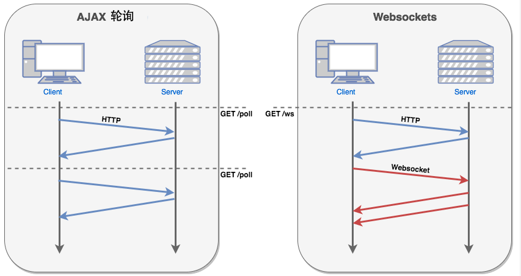

# 文件夹整体结构

基本都是一些底层用到的较基础的函数方法，没有涉及链的东西

- CMakeModules 主要包含CMake编译所需要使用的一些配置信息和方法
- GitVersionGen 
- include/fc
- secp256k1
- src
- test
- vendor/websocket

# CMakeModules

- ArguementParser.cmake 参数解析
- FindGMP.cmake 
- FindReadline.cmake
- FindSecp256k1.camke
- FindVLD.cmake
- ParseLibraryList.cmake
- SetupTargetMacros.cmake
- UseLibraryMacros.cmake
- VersionMacros.cmake

# include/fc  基础函数

- compress 压缩处理
  - smaz.hpp 压缩&解压
  - zlib.hpp 解压
- container 数组容器打包在一个stream中
> C++中的容器类包括“顺序存储结构”和“关联存储结构”，前者包括vector，list，deque等；后者包括set，map，multiset，multimap等。

- crypto 所有常见加密算法、签名等方法合集

- exception 错误处理机制

- interprocess 进程管理，包括本地进程启动、管理；与外部进程的交互管理；文件转为自定义的结构体；对结构体的操作等

- io 数据流的输入输出机制

- log 日志

- network 

  - http/http_client，主要方法有
    - post_sync 发起消息同步 .cpp
    - add_cert 添加证书 .h
    - set_verify_peers 设置可信任的节点 .h

  - ip.hpp 
    - class address 对IP地址的一些封装，例如判断IP是否是本地IP还是外部IP还是两者集合
    - class endpoint 将IP:PORT转为一个endpoint
  - message_buffer.hpp
  - platform_root_ca.hpp ssl通讯地址
  - resolve.hpp    .h
  - udp_socket.hpp .h
  - url.hpp 解析url  proto, host, user, pass, path, query, args, port ….

- reflect 提供对象T的访问方法，如果T是枚举类型enum 会有一些特殊方法

- rpc rpc接口相关的class和函数定义

  - api_connection.hpp
  - binary_api_connection.hpp
  - cli.hpp
  - http_api.hpp
  - json_connection.hpp
  - variant_connection.hpp
  - variant_stream.hpp
  - websocket_api.hpp

- actor.hpp

- aligned.hpp

- any.hpp

- api.hpp

- array.hpp

- bitutil.hpp

- bloom_filter.hpp

- filesystem.hpp

- fixed_string.hpp

- fwd.hpp

- fwd_impl.hpp

- git_revision.hpp

- make_fused.hpp

- noncopyable.hpp

- optional.hpp

- platform_independence.hpp

- real128.hpp

- safe.hpp

- scoped_exit.hp

- smart_ref_fwd.hpp

- smart_ref_impl.hpp

- static_variant.hpp

- string.hpp

- time.hpp

- tuple.hpp

- uint128.hpp

- unique_ptr.hpp

- utf8.hpp

- utility.hpp

- variant.hpp

- variant_object.hpp

- vector.hpp

- vector_fwd.hpp

# spec256k1

[github 项目地址](https://github.com/cryptonomex/secp256k1-zkp/tree/bd067945ead3b514fba884abd0de95fc4b5db9aeExperimental) ：fork of [libsecp256k1](https://github.com/ElementsProject/secp256k1-zkp) with support for pedersen commitments and range proofs.

针对spec256k1椭圆算法的函数封装

- sp256k1 ECDSA 签名/验证和密钥生成。
- 添加 私钥/公钥。
- 私钥、公钥、签名的序列化/解析。
- 恒定时间、恒定的内存访问签名和 pubkey 生成。
- 非随机 DSA (通过 RFC6979 或呼叫方提供的功能）

# src 

基于 include/fc 定义的封装和实现 cpp

- interprocess
- io
- log
- network
- rpc
- thread
- utf8
- byteswap.cpp
- exception.cpp
- ...

# vendor/websocketpp

项目原地址 https://github.com/zaphoyd/websocketpp

WebSocket 是 HTML5 开始提供的一种在单个 TCP 连接上进行全双工通讯的协议。

WebSocket 使得客户端和服务器之间的数据交换变得更加简单，允许服务端主动向客户端推送数据。在 WebSocket API 中，浏览器和服务器只需要完成一次握手，两者之间就直接可以创建持久性的连接，并进行双向数据传输。

websocketpp 是 C++ 的 WebSocket 客户端/服务器库。它是一个开源的只包含头文件的 C++ 库，它实现了 RFC6455 WebSocket 协议。它允许向 C++ 程序中集成 WebSocket 客户端和服务器功能。它使用可交换的网络传输模块，包括基于 C++ iostreams 的和基于 [Boost Asio](http://www.boost.org/doc/libs/1_48_0/doc/html/boost_asio.html) 的。

- **docs**: This documentation

- **examples**: Example programs that demonstrate how to build basic versions of some commonly used patterns for WebSocket clients and servers. 

- **test**: Unit tests that confirm that the code you have works properly and help detect platform specific issues. 单元测试

- **tutorials**: Detailed walkthroughs of a select set of the example programs. 教程

- **websocketpp**: All of the library code and default configuration files. 所有源码的配置文件

  